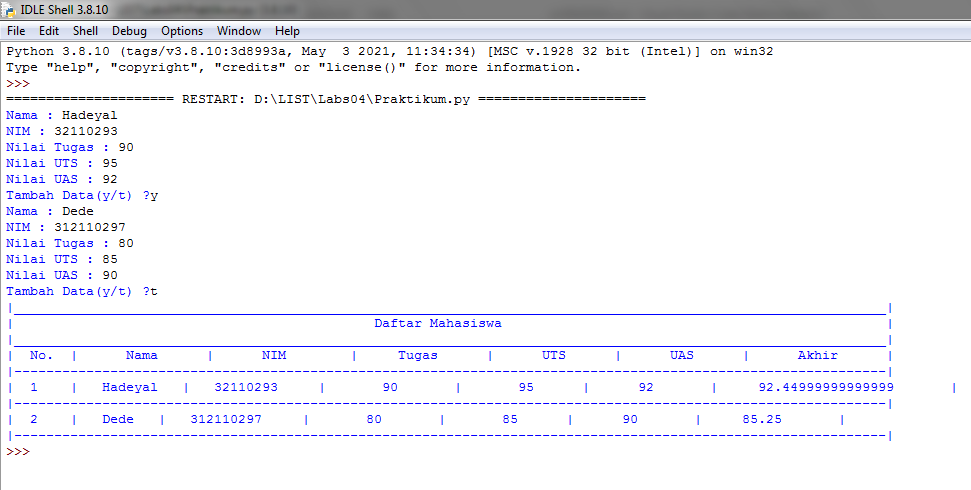

# TUGAS PRAKTIKUM 4
## Latihan
### Pertama 
    Kita harus membuat list sebanyak 5 element dengan nilai bebas, seperti pada gambar dibawah ini :
!.[gambar1].(ss/ss1.png)
### Kedua 
    Menampilkan element ke-3 sesuai perintah tugas yang diberikan, seperti gambar dibawah ini :
!.[gambar2].(ss/ss2.png)
### Ketiga
    Mengambil nilai yang element ke-2 sampai element ke-4, seperti gambar di bawah ini :
!.[gambar3].(ss/ss3.[png])
### Keempat
    Mengambil element terakhir, seperti gambar dibawah ini :
!.[gambar4].(ss/ss4.png)
### Kelima
    Mengubah element ke-4 dengan nilai lainnya, seperti gambar dibawah ini :
!.[gambar5].(ss/ss5.png)
### Keenam
    Mengubah element ke-4 samapai  element terakhir, seperti gambar dibawah ini :
!.[gambar6].(ss/ss6.png)
### Ketujuh
    Mengambil 2 bagian dari list pertama dan di jadikan list kedua, seperti gambar dibawah ini :
!.[gambar7].(ss/ss7.png)
### Kedelapan
    Menambah list ke-2 dengan 3 nilai, seperti gambar dibawah ini :
!.[gambar8].(ss/ss8.png)
### Kesembilan 
    Menggabungkan list pertama dengan list kedua, seperti gambar dibawah ini :
!.[gambar9].(ss/ss9.png)

Berikut adalah tampilan program seluruhnya :
!.[gambar10].(ss/ss10.png)

Dan ini tampilan hasil program ketika di jalankan :
!.[gambar11].(ss/ss11.png)

### Selesai

## TUGAS PRAKTIKUM

### Membuat List Nilai Mahasiswa
### Pertama 
    saya akan membuat flowchart terlebih dahulu untuk mempermudah tugas praktikum ini, seperti gambar dibawah :
!.[gambar12].(ss/ss12.png)
### Kedua 
    Membuat program untuk list nilai mahasiswa, seperti gambar dibawah ini :
!.[gambar13].(ss/ss13.png)
### Ketiga
    KETERANGAN
    ```python 
i=0
```
- diatas adalah untuk menginisiasikan variable i sama dengan 0, karena diprogram ini akan menggunakan perulangan while dan for, jadi perlu menginisiasikan agar tidak terjadi eror
```python
nama =[]
nim =[]
tugas=[]
uts=[]
uas=[]
nilaiakhir=[]
```
- Program di atas untuk mendefinisikan list nya, dan untuk menampung data
```python 
while True:
    s_nama=input("Nama  : ")
    nama.append(s_nama)
    s_nim=input("NIM   : ")
    nim.append(s_nim)
    i_tugas=input("Nilai Tugas : ")
    tugas.append(i_tugas)
    i_uts=input("Nilai UTS : ")
    uts.append(i_uts)
    i_uas=input("Nilai UAS : ")
    uas.append(i_uas)
```
    
- diatas adalah code untuk menginput isi dalam list tersebut, juga untuk menambahkan list jika sudah menginput 1 nama atau nilai dalam list, dengan menggunakan append dan menggunakan pengulangan while

```python
nilaiakhir1=(int(tugas1)*0.30)+(int(uts1)*0.35)+(int(uas1)*0.35)
nilaiakhir.append(nilaiakhir1)
```
- diatas adalah code untuk menghitung nilai akhir dengan kondisi nilai akhir 30% dari nilai tugas, ditambah 35% dari nilai UTS dan juga 35% dari nilai UAS, dengan kemudian diubah persentase menjadi bentuk desimal, maka terdapat 0.30, 0.35. sedangkan untuk nilai_akhir.append adalah untuk menambahkan list dari yang telah di inputkan sebelum akhirnya di tampilkan

```python
more=""
    while more!="y" and more!="t":
        more=input("Tambah Data(y/t) ?")
    i+=1
    if more=="t":
        break
```
- Program diatas adalah untuk perintah menambahkan data dengan pertanyaan ya atau tidak, dengan definisi jika ya, maka ketikkan y pada keyboard, maka akan mengulang inputan list. dan jika tidak, ketikkan t paada keyboard, maka akan menampilkan hasil list yang telah di inputkan
```python
print("._____________________________________________________________________________________________________________.")
print("|                                             Daftar Mahasiswa                                                |")
print("|_____________________________________________________________________________________________________________|")
print("|  No.  |      Nama      |      NIM        |     Tugas      |      UTS      |      UAS      |      Akhir      |")
print("|-------------------------------------------------------------------------------------------------------------|")
```
- untuk membuat border agar terlihat rapi dan enak dipandang
```python
for n in range(i):
    print("| ",n+1,"   |  ",nama[n],"  |  ",nim[n],"    |      ",tugas[n],"      |      ",uts[n],"     |     ",uas[n],"      |    ",nilaiakhir[n],"      |")
    print("|-------------------------------------------------------------------------------------------------------------|")
```
- sedangkan ini adalah untuk menampilkan hasil dari list yang telah diinputkan, dengan menggunakan perulangan for n in renge
### Berikut hasil dari programnya

## Selesai


